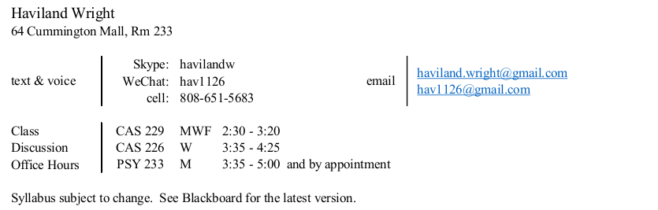

\pagestyle{fancy}

\rhead{}

\lfoot{MA415\\MA615 / Spring 2017}
\rfoot{Version: 2017-01-21}

\setlength{\columnsep}{3cm}

 

#Description

The purpose of this course is to provide you with the instruction and experience you need to develop and execute data analytic workflows using R. R is an open source programming language written by and for statisticians.  It is supported by a broad community of developers who extend the language by writing packages that implement methods for data acquisition, exploration, manipulation, presentation, graphical visualization, statistical computations, and many other useful things.  The R community also provides documentation, working examples of package applications, and active online discussions about how R can be optimized and enhanced  for data analysis, presentations, and reproducible research. R can be accessed and used in many ways.  In this course you will learn to use R in an environment assembled with open source tools that support code development, revision control, R package management, and applications for creating documentation, presentations, and final deliverables.  The integrating component of this environment is RStudio.  

By the end of the course, you will have hands-on experience with data acquisition, visualization, cleaning, and organization; analysis and modeling; report preparation, dynamic web presentations, and delivery of reproducible research. You will have produced maps , analyzed data from relational databases, and used R to analyze large data sets.  Through the course exercises you will revisit topics from introductory  probability and statistics and put that knowledge to work.  

This course is organized in two sections.  The first section is focused on the R language itself and R packages used for data acquisition, organization, and description.   Assignments will cover basic features of the R language and will also include situations that are common in actual practice, including difficult-to-read data files, data coding issues, missing value coding and handling, data presentation choices, and so on.  The first section concludes with a project in which you prepare a data set for analysis and write a brief that (1) describes the steps you have taken to clean and organize the data, (2) addresses the provenance of the data and the reproducibility of the dataset, and (3) includes a brief description and exploration of the data.  

In the second section of the course, the focus will broaden, and you will use R as the core of an integrated environment for organizing complex data sets, preparing data analyses, and estimating parameters of statistical models. You will use R-based tools to  assemble presentations, websites, and documents that contain text, mathematics, maps, and plots. You will practice methods for database access and maintenance and for loading and analyzing datasets that are larger than R can normally load.  You will learn to deliver analytic results in self-contained modules that support reproduction of the analysis. There will be a final project.  

#Textbooks

Jared P. Lander, _R for Everyone_  
Pearson Education, 2014  

This book covers most of the topics that we will address in the course.  BUT, BEWARE.  You must go beyond this textbook.  Things are moving fast  in the R universe.  Some areas have already advanced beyond the state of the art when Lander's book was released in 2014.  For example, the *plyr* package he describes in Chapter 11 has been superseded by *dplyr*. Nevertheless, _R for Everyone_ gives our course a strong framework, offers coverage of key topics, and will give you a reference book you will want to use in the future.  

\vspace{.1in}

Hadley Wickham  
_Advanced R_
[CRC](https://www.crcpress.com/product/isbn/9781466586963)  
https://github.com/hadley/adv-r/  
http://adv-r.had.co.nz/  

This is a book authored by one of R's most active developers. Wickham is the author of the ggplot2, ggvis, dplyr, tidyr and many other packages that you will use in this course. This fact alone makes his newly released book worth having. But there's more. Wickham's clear explanations of the technical underpinnings of R will make R easier to understand and use.  The book is available online and in hard copy.

\vspace{.1in}

W. N. Venables, D. M. Smith and the R Core Team  
[An Introduction to R Version 3.3.1 (2016-06-21)](https://cran.r-project.org/)

\vspace{.1in}

Scott Chacon and Ben Straug  
_Pro Git_ , 2nd Edition  
[ProGit](https://git-scm.com/book/en/v2)  
https://git-scm.com/book/en/v2  

#Policies

For graduate students, registered for MA615,
course policies are governed by 
[Graduate School of Arts & Sciences](http://www.bu.edu/academics/grs/). 
See 
[GRS Policies](http://www.bu.edu/academics/grs/policies/), 
especially the 
[GRS Academic Conduct Code](http://bit.ly/1TSFr57).

For undergraduates, registered for MA415, 
course policies are governed by 
[College of Arts & Sciences](http://www.bu.edu/academics/cas/).
See 
[CAS Policies](http://www.bu.edu/academics/cas/policies/), 
especially the 
[CAS Academic Conduct Code](http://bit.ly/1TpMSS7).

\newpage

#Attendance, Assignments, Grades

Assignments for this course will be posted on Blackboard. 
Grading will include the following factors and weights as follows: Homework 10, Midterm Project 30, Final Project 30, quizzes & attendance 10, spark of life 10, peer assessment 10.

\vspace{.2in}

Three kinds of assignments are planned:

* __Reading__ assignments should be completed before class. Reading assignments may be reinforced by a pre-class quiz or an in-class assignment.  

* __Homework__ assignments will focus on coding, data analysis, and written explanations.  Keep in mind that homework will be evaluated on the basis of statistical content in addition to the quality of submitted code. I am planning to use  __peer assessment__ to provide code review practice.

* The __midterm__ and __final projects__ will integrate key topics in the course.
    + The midterm project will focus on preparing a dataset for analysis and modeling.   
    + The final project will emphasize R functionality for combining statistical methods with graphical presentations that contribute insight and clarity.   

\vspace{.2in}

__Project assessment__ will focus on five criteria:

__Organization:__ The work is well-organized and is presented in a form that is easy to read and understand. Analysis combines numeric, graphical, and verbal presentations.

__Planning:__  The approach taken reflects a strategy formed by understanding the problem to be solved.

__Execution:__  A minimum amount of code has been used.  The code runs without error, reproducing the product that has been submitted

__Clarity:__ The code is easy to read and understand. The code and associated comments form a seamless whole.

__Curiosity:__ The work submitted reflects a process of exploration to make the analysis as clear as possible.

